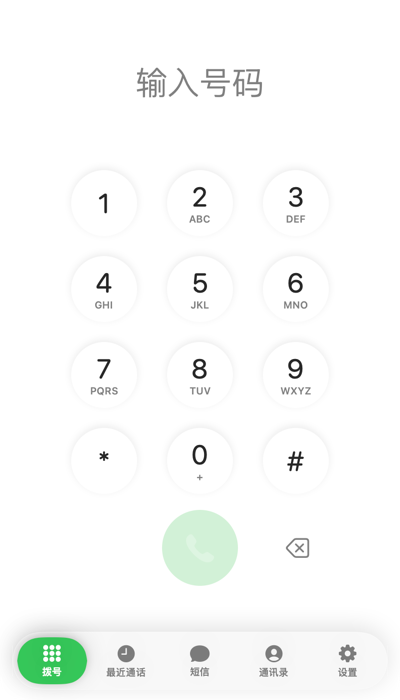
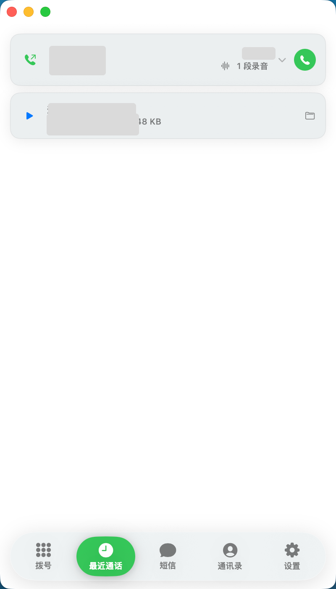
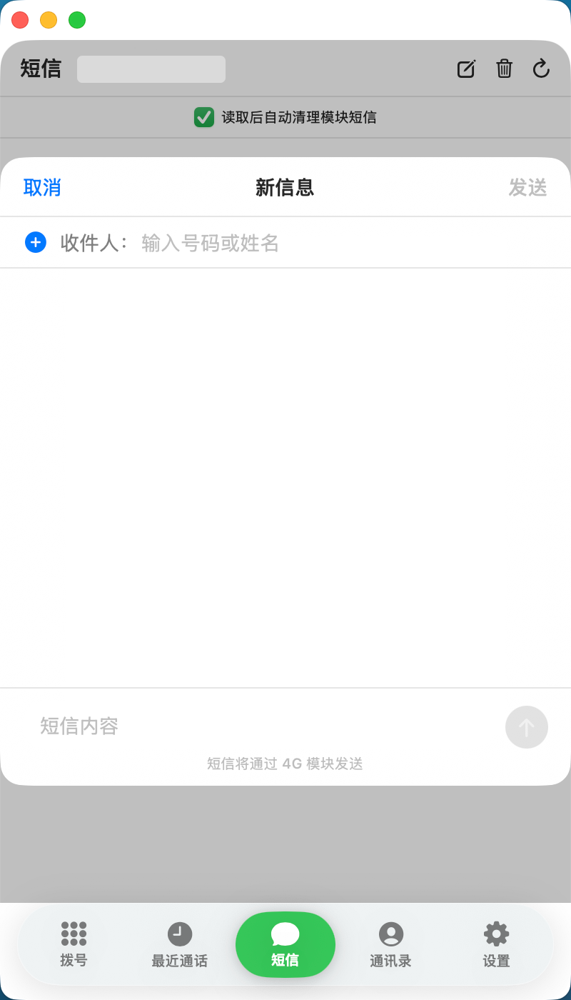
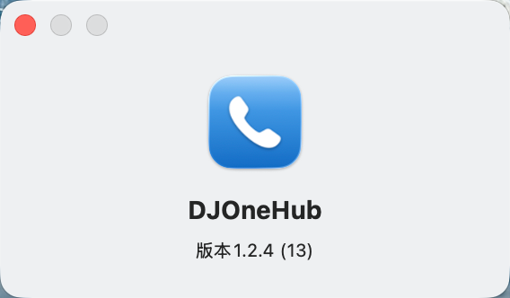

# DJOneHub

> 让大疆第一代 4G 模块成为 Mac 上长期可用的实体 SIM 终端。

> [!IMPORTANT]
> 📦 **标准应用安装包已上传**：[Releases](https://github.com/MiQieR/DJOneHub-mac-enhanced-dmg/releases) 提供标准 macOS DMG 安装包，双击打开后拖拽 `DJOneHub.app` 到 `Applications` 目录即可完成安装：
> - `DJOneHub-macOS-universal-v1.2.9.dmg`：基于上游 v1.2.9，支持 Apple Silicon 与 Intel Mac 通用双架构；包含完整通话、短信、联系人、GPS、eSIM 管理功能。
>
> 更新内容见 [CHANGELOG.md](CHANGELOG.md)。

DJOneHub 是一个非官方开源项目。它通过模块已有 USB 接口提供短信、4G、GPS、eSIM、来电及通话控制，不修改模块固件。

## v1.2.9：v1.2.5 — v1.2.9 更新汇总

### 通话与首次启用

- 独立 macOS App 集中管理拨号、接听、拒接、挂断、DTMF、通话记录、录音入口、短信、通讯录与设置；来电、短信提醒不需要网页常驻。
- 新模块、原始 DJI 配置、旧 UAC 与其他工具留下的完整 USB 配置均可识别。启用前先备份，验证失败自动回滚。
- 旧 UAC `…1,1,1,1,1,0,1` 已具备 USB Audio，不再强写 ADB 位，只补 IMS / VoLTE，避免模块返回 `OK` 但配置保持原样时误报失败。
- USB 模式切换、模块重启和重新枚举期间的临时 `USBCFG ERROR` 会自动重试；重新连接后会读取实际配置，不会沿用旧"已就绪"状态。

### 语音运行时

- 首次在「设置 → 语音运行时」确认后，App 从固定上游获取指定版本并校验 SHA-256，缓存到本机；后续模块重启或重插可复用缓存。
- 下载包含 Raw → GitHub Contents API → Raw 重试链路，并使用独立等待窗口，避免上游短暂失败或通用接口超时造成初始化中断。
- 模块侧语音运行时不包含在源码、DMG、ZIP 或 Release 中。

### iPhone / iPad 模式与发布包

- 「设置 → 连接模式」可切换 iPhone / iPad 模式：仅关闭 USB Audio，保留 USB 4G、AT 与短信，避免移动设备占用系统音频输出；接回运行 DJOneHub 的 Mac 后会恢复完整音频接口。
- 修复安装包误带入旧通知 App、设置页遗留固定版本号及连接模式入口缺失的问题。
- v1.2.9 同步提供 macOS Universal（Apple Silicon + Intel）安装包。

| 功能 | 说明 |
| --- | --- |
| 电话 | 拨号、接听、拒接、挂断、DTMF、通话记录和录音入口。 |
| 短信 | 收发短信、验证码预览；读取后可自动清理模块存储。 |
| 通讯录 | 可同步本机通讯录，用姓名或号码拨号、发短信。 |
| 网络与 GPS | USB 4G、Wi-Fi 优先、4G 兜底、GPS/GNSS 状态与菜单栏提示。 |
| iPhone / iPad 模式 | 关闭 USB Audio、保留上网和短信；下次接回 Mac 自动恢复完整模式。 |
| 模块工具 | eUICC Profile、AT 调试、网络诊断和初始化状态。 |

## 界面预览

> 以下均为真实界面截图；号码、联系人、头像、验证码和时间已遮蔽。

### 电话

<p align="center">
  
  
  
</p>

拨号、接听、拒接、挂断、DTMF、通话记录与录音入口统一在电话页。

<p align="center">
  
  
</p>

### 短信与通讯录

<p align="center">
  
  
</p>

短信支持收发、验证码预览和自动清理；通讯录可同步本机联系人并用于检索。

<p align="center">
  
</p>

### 设置与版本

<p align="center">
  
</p>

## 下载与平台状态

| 平台 | 包 | 当前状态 |
| --- | --- | --- |
| macOS 13+ | `DJOneHub-macOS-universal-v1.2.9.dmg` | Apple Silicon 实机验证；包内含 arm64 + x86_64，Intel 尚未真机验证。 |

## 通话与开源边界

源码包含 macOS App、Go 后端、MaVo MIT 音频适配代码和构建脚本。

Mac 双向通话仍需要模块侧语音运行时。该运行时**不随本仓库、Release 或 DMG 提供，也不会由 DJOneHub 镜像**。用户一次明确确认后，App 才会从固定上游来源获取指定版本，逐项校验 SHA-256 后保存到本机。上游文件、模块型号、固件、SIM 和运营商条件均可能影响双向语音可用性。

请不要把未知来源的二进制提交到 Issue、PR 或衍生 Release。完整边界见 [OPEN_SOURCE_SCOPE.md](OPEN_SOURCE_SCOPE.md)。

## 接入准备

### 硬件

- 大疆第一代 4G 模块
- 可正常使用的实体 SIM，或与当前实现兼容的实体 eUICC/eSIM 卡片
- 支持数据传输的 USB-C 线缆
- Apple Silicon Mac（Intel Mac 包含在安装包中，但尚未真机验证）

模块的 USB 设备标识通常为 `2ca3:4006`。如果连接后 macOS 完全没有发现 USB 设备，请优先确认线缆支持数据传输。

### 系统

- macOS 13 Ventura 或更新版本
- 支持 Apple Silicon（M1、M2、M3、M4 及后续）与 Intel Mac

发行包已经携带运行所需的 `libusb`。普通用户不需要安装 Homebrew、Go、Node.js 或其他开发环境。

### 指示灯

| 状态 | 常见含义 |
| --- | --- |
| 红色常亮 | 未插入 SIM 卡 |
| 红色闪烁 | SIM 卡未被正常识别 |
| 绿色常亮 | SIM 已识别，蜂窝信号通常较好 |
| 绿色闪烁 | SIM 已识别，蜂窝信号可能较弱或仍在注册 |

不同固件的灯光行为可能存在差异，最终应以网页中的 SIM、信号和网络注册状态为准。

## 接入原理

大疆第一代 4G 模块通过不同的 USB 组合模式向 macOS 暴露管理接口或网络接口。DJOneHub 没有修改模块固件，而是根据模块现有 USB 接口实现本机通信，并预设了常用的短信模式和上网模式。

| 模式 | 页面名称 | 主要用途 |
| --- | --- | --- |
| 模式 0 | 短信模式 | 读取状态、收发短信、管理 eSIM 和发送 AT 指令 |
| 模式 1 | 上网模式 | 向 macOS 暴露 USB 网卡，通过 SIM 卡流量上网 |
| 模式 2 | 实验模式 2 | 用途尚未确认，不建议日常使用 |
| 模式 3 | 实验模式 3 | 用途尚未确认，不建议日常使用 |

切换模式时，模块会重新枚举 USB 接口，页面可能短暂显示设备断开。请等待系统重新识别，不要在 eSIM Profile 写入等关键操作过程中拔出模块或切换模式。

## 安装

1. 双击打开下载的 `DJOneHub-macOS-universal-v1.2.9.dmg`。
2. 将 `DJOneHub.app` 图标拖入 **Applications** 文件夹快捷方式。
3. 打开 macOS 的"访达" → "应用程序"，双击 **DJOneHub** 图标即可启动。

## 启动与菜单栏控制

1. 启动应用后，系统顶部状态栏会出现 **DJOneHub 状态栏图标**（4G 信号格/GPS 图标）。
2. **点击**状态栏图标：打开 DJOneHub 主窗口（拨号、短信、联系人、设置）。
3. **右键**状态栏图标（或点击主窗口内的设置）：
   - **开机自动启动**：在 App 的「设置」页面中开启或关闭开机自启动。
   - **退出 DJOneHub**：优雅退出应用并自动关闭后台服务。

## 卸载说明

要完全卸载 DJOneHub：
1. 右键状态栏图标或在 App 内退出程序。
2. 将 `/Applications/DJOneHub.app` 拖入废纸篓。
3.（可选）如需清除所有本地配置与日志，删除数据目录：`~/Library/Application Support/DJOneHub/`。

## macOS 阻止打开时

当前预览版没有使用 Apple Developer ID 公证签名。首次运行时，macOS 可能提示无法验证开发者或阻止程序启动。

请先打开：

```text
系统设置 -> 隐私与安全性
```

在安全提示附近选择"仍要打开"，然后重新启动 DJOneHub。

> [!CAUTION]
> 只应对从本项目可信 Release 页面下载、并核对过 SHA-256 的文件执行移除隔离属性的操作。

## 使用说明

### 短信模式

短信模式用于接收和发送短信、自动轮询新短信、提取常见验证码、管理 eSIM Profile 和发送 AT 指令。

"清空模块旧短信"只清理模块内部 `ME` 存储中的旧短信，例如二手模块可能残留的历史短信。网页收件箱主要缓存在程序内存中，关闭程序后，本次运行期间读取的短信缓存会自动清除。

发送国际短信时，请填写完整国际号码，区号和号码之间不需要空格：

```text
+86138XXXXXXXX
+447700900XXX
```

短信能否发送或接收，还取决于 SIM 套餐、漫游状态、运营商网络注册、短信中心配置和模块兼容性。

### eSIM 与卡片管理

该页面用于管理插在实体 SIM 卡槽中的兼容 eUICC/eSIM 卡片，不是用于管理 Mac 内置 eSIM。插入普通实体 SIM 时，可以忽略此页面。

当前支持：

- 读取 EID、固件、可用空间和已安装 Profile
- 查看 Profile 名称、服务商、类型和 ICCID
- 下载新的 Profile
- 启用不同 Profile
- 修改 Profile 名称
- 删除 Profile
- 检测卡片通讯录兼容性
- 将号码资料保存到模块通讯录，并按 ICCID 关联


不同实体 eUICC 产品即使都遵循 SGP.22，也不代表每项扩展功能完全一致。目前只在手头的兼容卡片上完成过主要功能验证，其他产品需要自行测试。

> [!WARNING]
> 启用、下载、改名和删除 Profile 都会改动实体卡片。写入过程中不要拔出模块。删除 Profile 通常不可撤销。

### 上网模式

切换到上网模式前，需要插入包含可用流量的 SIM。模块通常会通过 DHCP 为 Mac 分配类似 `192.168.225.x` 的局域网地址，并完成蜂窝网络接入和转发。


首页会显示当前下载、当前上传、本次下载、本次上传和本次总流量。本次总流量等于本次下载与本次上传之和，只统计当前 DJOneHub 进程运行期间的数据；刷新网页不会清零，关闭程序后，下次启动会从零重新统计。

在 macOS 网络设置中可以找到模块对应的网络服务，本机实测名称为 `Baiwang`：


如果切换到模块后代理失效，需要检查该网络服务的系统代理配置，或确认代理软件已启用 TUN/增强模式：


页面流量数据仅用于观察当前会话，不等同于运营商账单。

### AT 调试

AT 调试页面允许直接向模块发送指令，例如：

```text
AT
AT+CSQ
AT+COPS?
AT+CPIN?
AT+CNUM
```

AT 指令可以改变网络注册、PDP、USB 模式、短信存储和 SIM 状态。不了解作用的指令不要直接执行，也不要照搬来源不明的刷机或写入命令。

## 日志与本地数据

日志保存在：

```text
~/Library/Application Support/DJOneHub/logs/djonehub.log
~/Library/Application Support/DJOneHub/logs/notifier.log
```

运行状态和本地数据目录为：

```text
~/Library/Application Support/DJOneHub
```

管理页面默认仅供本机访问，同一局域网内的其他设备不能直接访问。

## 从源码构建

```sh
# macOS Universal DMG
scripts/build-dmg-universal.sh v1.2.9
```

构建 macOS 包需要完整 Xcode、Go、`pkg-config` 与网络下载官方 libusb 源码。

## 使用提醒

- 使用蜂窝数据、短信、通话与 eSIM 前，请确认运营商协议、资费及当地法律要求。
- GPS 默认关闭；定位信息仅在本机读取和展示。
- 本项目不会上传 SIM、短信、联系人、录音或卡片资料。
- 与 DJI、Quectel、运营商及 eSIM 厂商不存在隶属或授权关系。

许可证与第三方声明见 [LICENSE](LICENSE)、[THIRD_PARTY_NOTICES.md](THIRD_PARTY_NOTICES.md) 与 [OPEN_SOURCE_SCOPE.md](OPEN_SOURCE_SCOPE.md)。
